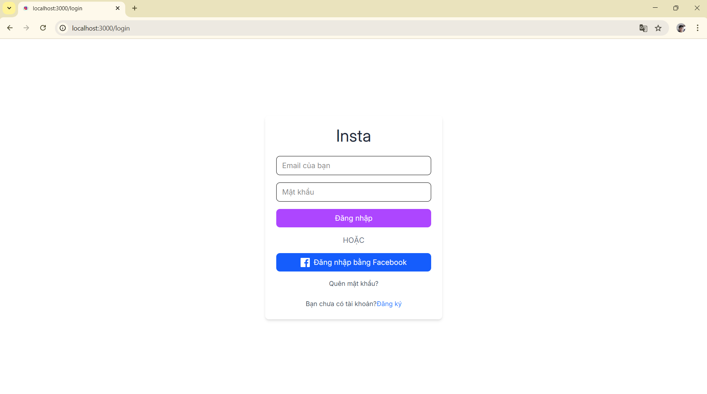
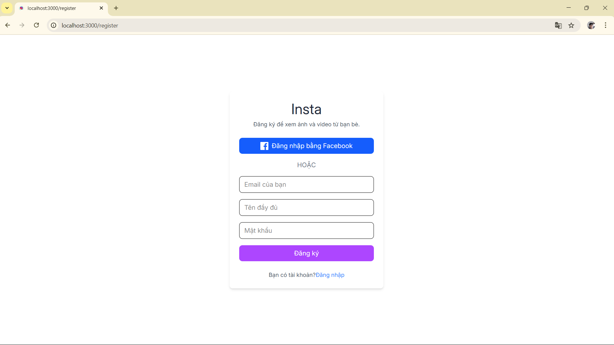
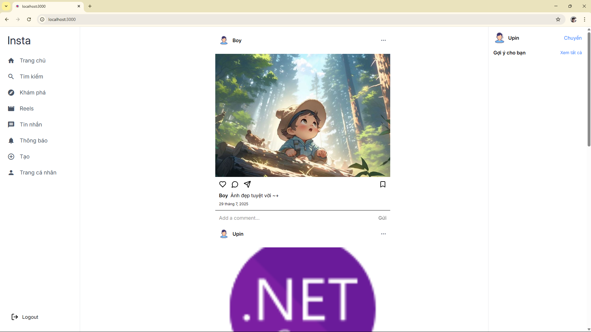
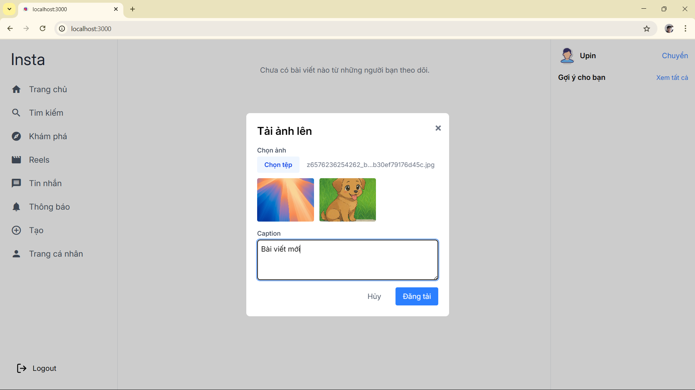
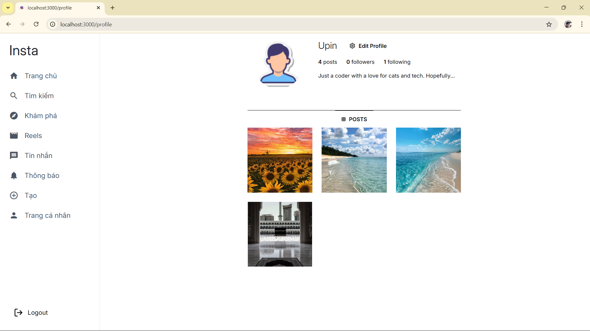
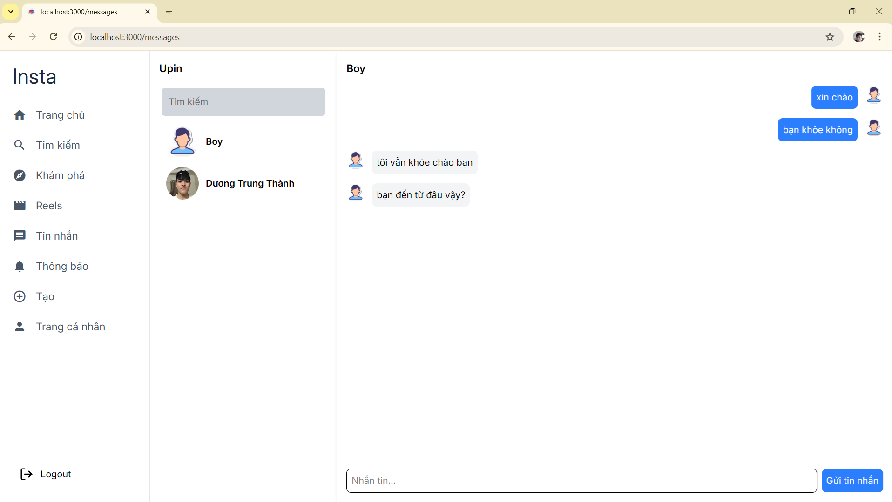

<!-- LOGO -->
<h1 align="center">Insta</h1>
<div align="center">
  
</div>

<!-- TABLE OF CONTENTS -->
<details>
  <summary>Table of Contents</summary>
  <ol>
    <li>
      <a href="#about-the-project">About The Project</a>
      <ul>
        <li><a href="#built-with">Built With</a></li>
      </ul>
    </li>
    <li>
      <a href="#getting-started">Getting Started</a>
      <ul>
        <li><a href="#prerequisites">Prerequisites</a></li>
        <li><a href="#installation">Installation</a></li>
      </ul>
    </li>
    <li><a href="#roadmap">Roadmap</a></li>
    <li><a href="#license">License</a></li>
  </ol>
</details>

<!-- ABOUT THE PROJECT -->
## About The Project
This is a full-stack social media web application built with React.js for the frontend and Spring Boot for the backend. The platform provides essential features for user interaction and content sharing, including:

- User authentication and registration, supporting both traditional email/password and Google OAuth login.

- A guided onboarding process for new users after login.

- Users can create posts with images and captions, and engage by liking or commenting on others' posts.

- A follow/unfollow system allows users to manage their social network.

- A personalized newsfeed displays posts from followed users to ensure a smooth and relevant browsing experience.

- A built-in chat system enables real-time messaging between users.

This project showcases my ability to integrate frontend and backend technologies to build a feature-rich, interactive web application with a strong focus on user experience and modern development practices.

<!-- Demo Images Grid -->
<div align="center">
  <table>
    <tr>
      <td align="center">
        
      </td>
      <td align="center">
        
      </td>
      <td align="center">
        
      </td>
    </tr>
    <tr>
      <td align="center">
        
      </td>
      <td align="center">
        
      </td>
      <td align="center">
        
      </td>
    </tr>
  </table>
</div>

<!-- Project Description -->


### Built With

<div align="center">
  <table>
    <tr>
      <td align="center" width="120">
        
      </td>
      <td align="center" width="120">
        
      </td>
      <td align="center" width="120">
        
      </td>
    </tr>
    <tr>
      <td align="center" width="120">
        
      </td>
      <td align="center" width="120">
        
      </td>
      <td align="center" width="120">
        
      </td>
    </tr>
    <tr>
      <td align="center" colspan="3">
        
      </td>
    </tr>
  </table>
</div>

## Getting Started

### Prerequisites
- Java 17+
- MySQL 8+
- Node.js 18+
- Redis 7+
- Docker (optional, for containerization)

### Installation
1. Clone the repo
   ```sh
   git clone https://github.com/upinmcSE/Insta.git
   ```
2. Navigate to the frontend directory to install dependencies and run
    ```sh
      cd frontend
      npm install
      npm run dev
    ```
3. Start the required services using Docker Compose  
   ```sh
      cd docker
      docker-compose up -d
   ```
4. Run the Spring Boot backend application
   ```sh
      cd backend
      ./mvnw spring-boot:run
   ```

## Roadmap
- [x] Users can create, login 
- [x] Users can update profile
- [x] Users can create post with images and caption
- [x] Users can view newfeed
- [x] Users can like and comment of others
- [x] Users can search for the people they want
- [x] Users can chat with each other
- [x] Users can receive notifications when someone likes and comments on their posts.
- [ ] Better UI/UX improvements
- [ ] Add more features upload video, reels , etc.


## License
[MIT](https://choosealicense.com/licenses/mit/)


