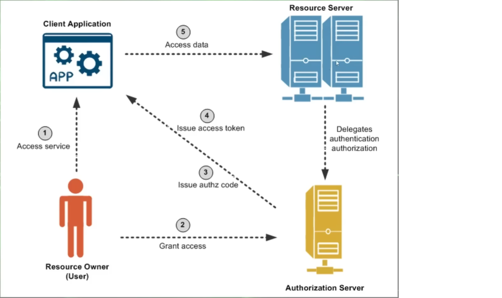
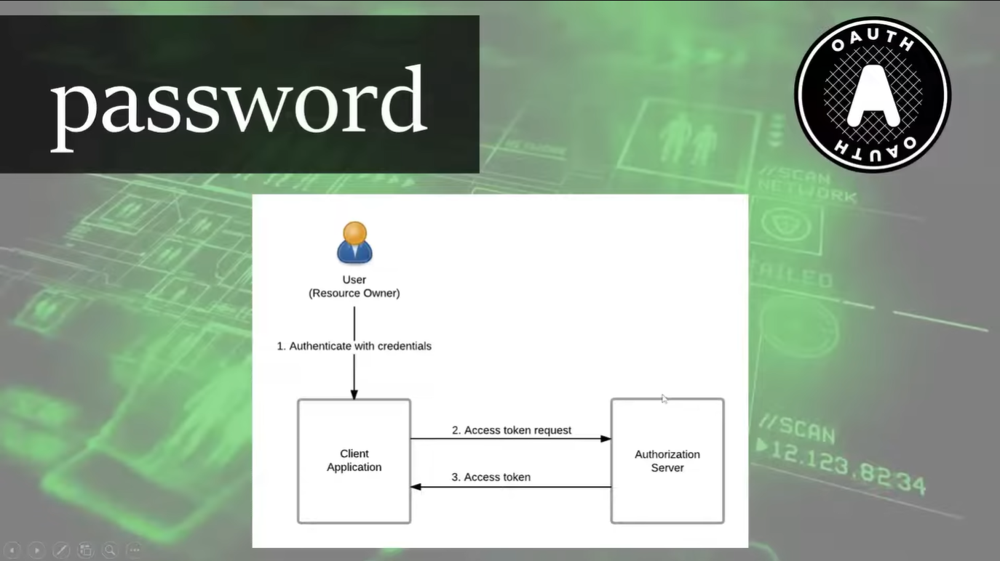
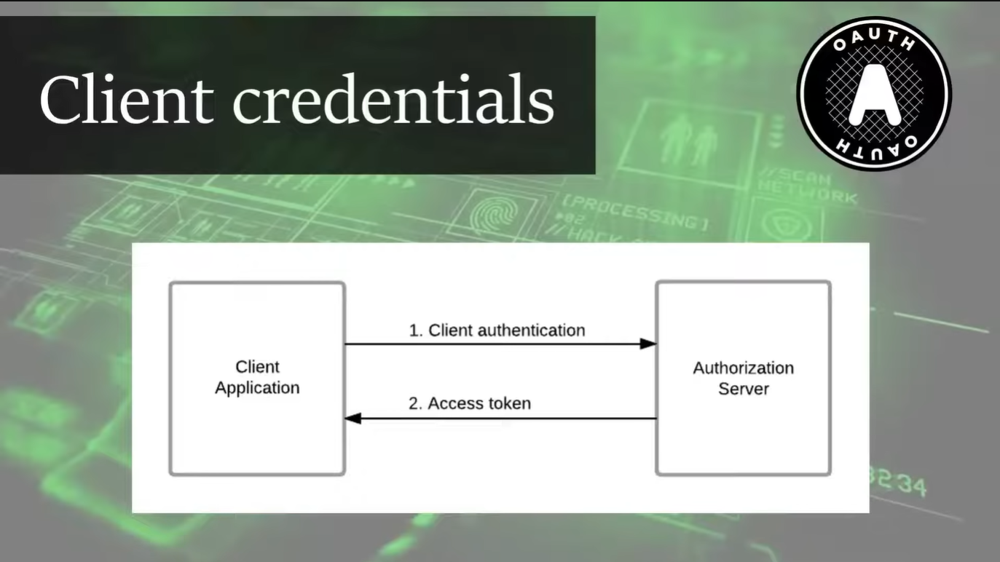
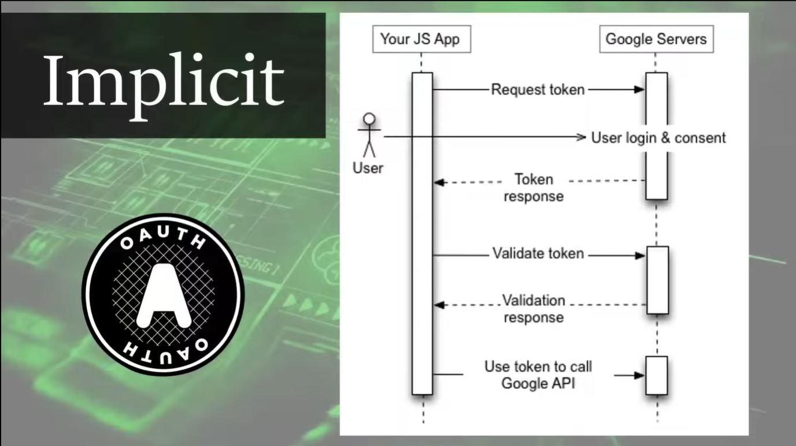
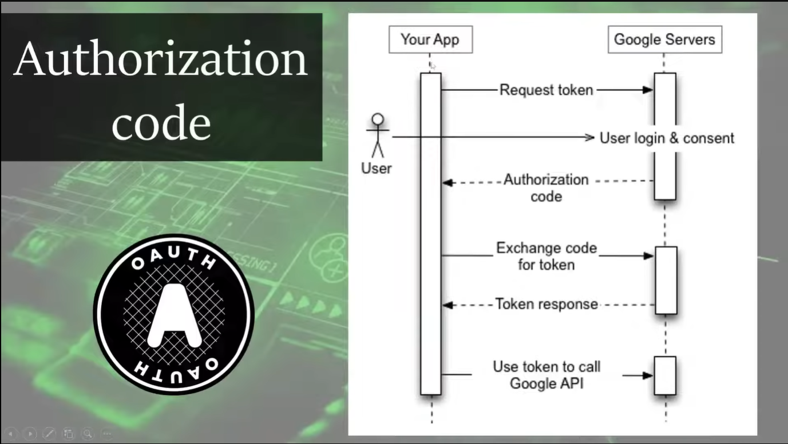

# Oauth2

## When and Why Oauth2?
- Ứng dụng của bạn cần truy cập tài nguyên thay mặt người dùng
- Bạn cần phân tách rõ ràng giẵ xác thực(authentication) và ủy quyền(authorization)
- Bạn cung cấp API public hoặc microservices
- Bạn muốn hỗ trợ ác client không tin cậy hoặc third party
- Bạn muốn áp dụng SSO

- Bảo mật hơn ( không cần cung cấp username/password cho ứng dụng bên thứ 3, dùng token thay password)
- Ủy quyền rõ ràng, kiểm soát tốt hơn (có thể thu hồi token bất cứ lúc nào)
- Tách biệt client và resource server
- Hỗ trợ nhiều loại client khác nhau
- Hỗ trợ refresh token


### What OpenId?


## Main actors
- **Resource owner ( chủ sở hữu tài nguyên):**
    - là người dùng cuối - người sở hữu dữ liệu cá nhân hoặc tài nguyên
    - cho phép hoặc từ chuối ứng dụng được quyền truy cập tài nguyên của mình
    - ex: Bạn – người đang đăng nhập vào Spotify và cho phép nó truy cập playlist của bạn trên YouTube Music.
    - ex: Bạn – cho phép một app quản lý công việc truy cập Google Calendar của bạn.

- **Resource server:**
    - là hệ thống lưu trữ và quản lý tài nguyên của người dùng
    - cung cấp dữ liệu khi nhận được access token hợp lệ từ chính client
    - ex: Google Drive API (nơi chứa tài liệu của bạn).
    - ex: GitHub API (chứa các repo bạn sở hữu).

- **Client:**
    - là ứng dụng muốn truy cập tài nguyên thay mặt người dùng
    - gửi yêu cầu đến Authorization Server để xin access token sau đó dùng access token để gọi tới Resource Server và truy cập dữ liệu.
    - ex: Một frontend (React, Angular, Mobile) gọi backend service.

- **Authrorization server:**
    - là hệ thống xác thực người dùng và phát hành access token cho client.
    - Xác thực danh tính của resource owner (người dùng).
    - kiểm tra xem người dùng có chi phép client truy cập không
    - phát hành access token( và refresh token nếu cần)
    - ex: Google OAuth2 Server, Keycloak, Auth0, Spring Authorization Server

## Fundamental concepts
- **Service Provider**
    - Là hệ thống cung cấp dịch vụ hoặc tài nguyên mà ứng dụng (client) muốn truy cập thay mặt người dùng.
    - Xác thực người dùng (nếu có).
    - Quản lý quyền truy cập đến tài nguyên người dùng.
    - ex: Google, Facebook, GitHub

- **Scope**
    - Scope là phạm vi quyền truy cập mà ứng dụng client yêu cầu khi xin access token.
    - Giúp giới hạn quyền của access token – tức là token chỉ có quyền làm những gì được chỉ định trong scope.

- **Id Token**
    - ID Token là JWT (JSON Web Token) chứa thông tin danh tính người dùng, được cấp bởi Authorization Server.
    - Xác nhận danh tính người dùng sau khi đăng nhập.
    - Dùng trong SSO (Single Sign-On).

- **Access Token**
    - Access Token là token được cấp cho client để truy cập tài nguyên (API) thay mặt người dùng.
    - Gửi kèm trong header (thường là Authorization: Bearer <token>) khi gọi Resource Server.
    - Có thời hạn sống (expires in).

- **Refresh Token**
    - Token dùng để yêu cầu cấp mới access token mà không cần người dùng đăng nhập lại.
    - Kéo dài phiên làm việc (session) mà vẫn đảm bảo bảo mật.
    - Giảm việc bắt người dùng đăng nhập liên tục.

- **Discovery Endpoint**
    - Một URL đặc biệt cung cấp metadata mô tả cấu hình của Authorization Server hoặc Identity Provider.
    - Giúp client tự động cấu hình thông qua một endpoint duy nhất.
    - ex : https://<issuer>/.well-known/openid-configuration
    - ex: 
    ```json
        {
            "issuer": "https://accounts.google.com",
            "authorization_endpoint": "...",
            "token_endpoint": "...",
            "userinfo_endpoint": "...",
            "jwks_uri": "...",
            "scopes_supported": ["openid", "profile", "email"]
        }

    ```


## Integrate with OAuth2 IDP

- **Consent**
    - Đây là bước người dùng cấp quyền cho ứng dụng client truy cập vào các thông tin cá nhân hoặc tài nguyên từ Identity Provider (IDP).
    - Người dùng sẽ thấy một màn hình hiển thị các quyền mà ứng dụng yêu cầu (như email, profile, calendar...).
    - Sau khi người dùng đồng ý, Authorization Server sẽ cấp access token và/hoặc ID token cho client.
    - Ví dụ: Khi đăng nhập bằng Google, bạn sẽ thấy yêu cầu cho phép ứng dụng truy cập email và thông tin hồ sơ.

- **Onboarding user**
    - Là quy trình xử lý người dùng mới sau khi xác thực thành công qua OAuth2.
    - Ứng dụng sẽ lấy thông tin người dùng (từ ID token hoặc qua userinfo endpoint) và tạo bản ghi trong hệ thống nội bộ (database).
    - Nếu người dùng đã tồn tại, hệ thống có thể cập nhật thông tin hoặc bỏ qua bước này.
    - Mục tiêu là ánh xạ người dùng từ IDP với user nội bộ để quản lý dễ dàng hơn.

- **Authentication and Authorization**
    - **Authentication** (xác thực): Ứng dụng xác minh danh tính người dùng thông qua ID token. Dựa vào token này, ứng dụng biết ai đang đăng nhập.
    - **Authorization** (phân quyền): Sau khi xác thực, hệ thống quyết định xem người dùng có quyền làm gì dựa trên role, scope hoặc thông tin nội bộ.
    - Access token được sử dụng để gọi các API bảo vệ, còn ID token được dùng để xác minh danh tính người dùng.
    - Có thể sử dụng thông tin từ token (claims) hoặc hệ thống phân quyền riêng để thực hiện authorization.


## Folow
-   [User (Resource Owner)] 
            ⬇️ cấp quyền
    [Client (App)] 
            ⬇️ lấy token từ
    [Authorization Server] 
            ⬇️ dùng token để truy cập
    [Resource Server]

- 


## Grant-Type
- **password**
    - Client gửi trực tiếp username và password của người dùng cho Authorization Server để lấy access token.
    - khi nào dùng: Ứng dụng đáng tin cậy cao, do chính bạn kiểm soát (vd: mobile app, desktop app của chính công ty bạn).
    - ưu điểm: Đơn giản, nhanh.
    - nhược điểm: Rất không an toàn nếu lộ mật khẩu, vì client giữ trực tiếp thông tin đăng nhập, không tách biệt rõ ràng xác thực và ủy quyền.
    - 
- **client credentials**
    - Client tự xác thực bằng client_id và client_secret để lấy access token – không liên quan gì đến người dùng.
    - khi nào dùng: Giao tiếp service-to-service (server to server), truy cập tài nguyên do chính client sở hữu, không cần người dùng.
    - ưu điểm: An toàn nếu dùng trong môi trường backend, Dễ triển khai.
    - nhược điểm: Không dùng được cho user-level access.
    - 
- **implicit(Đã bị deprecated)**
    - Client (thường là SPA – Single Page App) nhận access token trực tiếp từ redirect URL, không qua bước trao đổi mã code.
    - khi nào dùng: Trước đây được dùng cho ứng dụng JavaScript không có backend (SPA).
    - nhược điểm: Access token lộ trên URL, dễ bị đánh cắp qua log, history, referrer...
    - 
- **authorization code**
    - Flow an toàn nhất và được dùng phổ biến hiện nay.
    Client nhận được authorization code từ redirect URL, rồi dùng code này để lấy access token từ server.
    - khi nào dùng: Web app, SPA, mobile app, backend frontend tách biệt, khi cần bảo mật cao
    - ưu điểm: Bảo mật cao (token không nằm trong URL), hỗ trợ refresh token, dễ kiểm soát phạm vi truy cập (scope).
    - 

    - 

### Liệu có đánh cắp được thông tin user ?
- không bởi vì khi login with gg or facebook thì khi xác thực thành công thì 
- gg or fb chỉ redirect về đúng uri đã định add authorized, 1 cái nữa là
- gg or fb chỉ cho login với cái domain đã đăng ký (JS origins)

### google oauth2 endpoint
- https://developers.google.com/identity/protocols/oauth2/web-server
